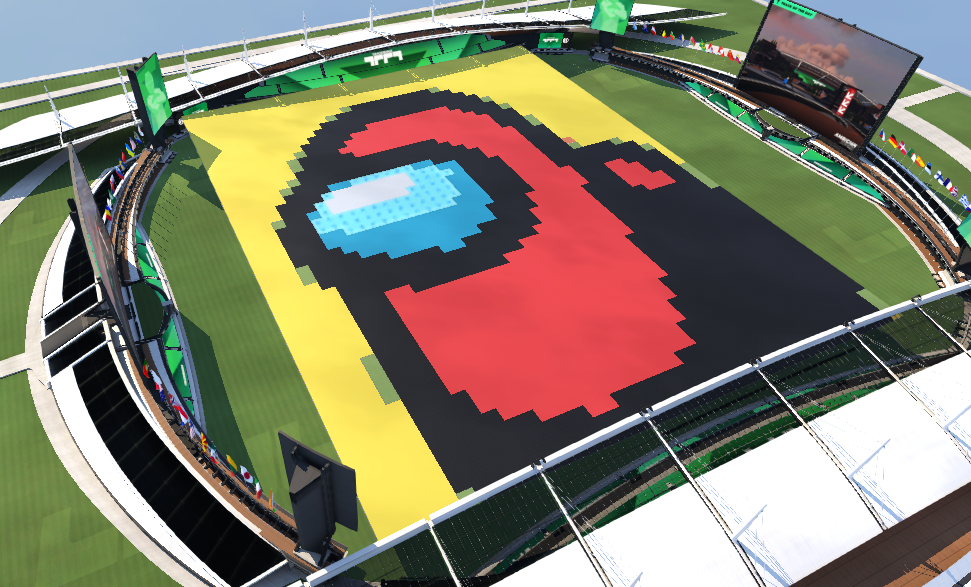

# ImgToGBX - Image to TrackMania Map Converter

This project resizes and converts images into TrackMania maps by mapping each pixel to the closest matching block based on color.



## Download and Installation

### 1. Download the Release
1. Go to the [Releases](https://github.com/DaaanielBrandao/ImgToGBX/releases) page
2. Download the latest release ZIP
3. Extract the ZIP file to a folder of your choice

### 2. Required Files
Make sure you have the following files in your extracted folder:
- `ImgToGBX.exe` (main executable)
- `config/color-to-block-mapping.json` (color mapping configuration)
- `InputMap/nothing.Map.Gbx` (base map template)
- `Imgs/example.png` (example image)

## Usage

### Basic Usage
```bash
ImgToGBX
```
This will use the default settings and convert `Imgs/example.png` to a TrackMania map.

### Command Line Options

| Option | Long Option | Description | Default |
|--------|-------------|-------------|---------|
| `-i` | `--image-path` | Path of the input image file | `Imgs/example.png` |
| `-o` | `--output-map-path` | Path for the output map | `OutputMap/test.Map.Gbx` |
| `-b` | `--input-map-path` | Path of the base map to use | `InputMap/nothing.Map.Gbx` |
| `-x` | `--resolution-x` | Width resolution for the image (max: 48) | `48` |
| `-y` | `--resolution-y` | Height resolution for the image (max: 48) | `48` |
| `-z` | `--height` | Height (Y coordinate) for placing blocks | `10` |
| `-c` | `--config-file` | Path to the color-to-block mapping configuration file | `config/color-to-block-mapping.json` |
| `-h` | `--help` | Show help information | - |

### Examples

**Convert a custom image:**
```bash
ImgToGBX -i myimage.png -o mymap.Map.Gbx
```

**Use custom height and resolution:**
```bash
ImgToGBX --image-path test.png --output-map-path result -x 24 -y 24 --height 15
```

**Use a custom base map:**
```bash
ImgToGBX -i photo.jpg -b InputMap/custom.Map.Gbx -o output.Map.Gbx
```

## Configuration

The color-to-block mapping is configured in `config/color-to-block-mapping.json`. This file defines which TrackMania blocks are used for different colors in your image. You can change this file to make your custom palette. 

